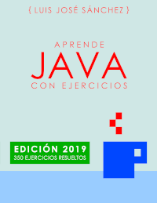

# PROGRAMACIÓN CON JAVA

Repositorio que contendrá los ejemplos y ejercicios que abordemos en el módulo de **Programación de 1º DAW**.

Estos ejemplos y soluciones se extraen del libro **"Aprende Java con Ejercicios"**.

Puedes descargar el libro mediante el siguiente enlace:
<http://leanpub.com/aprendejava>